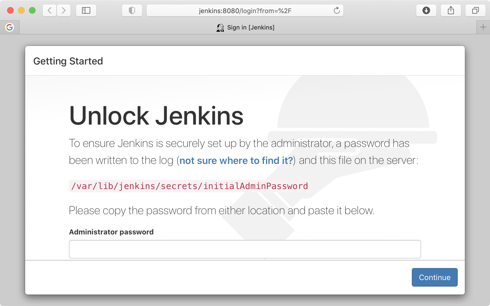

# Prerequirment for Terraform Console 서버
* Ubuntu 18.04 +
* Terraform
* aws cli
* python 3.6 +


# Jenkins install with Terraform
* Script
```
cd
git clone https://github.com/Finfra/jenkins_quickstart
cd jenkins_quickstart/terraform/
ssh-keygen -f ~/.ssh/id_rsa -N ''

terraform init
terraform plan
terraform apply -auto-approve
```

* Terraform이 Apply한 결과를 통해 각 서버의 IP를 알아 냅니다.
```
Outputs:
Jenkins-ip = 15.165.74.195
jm1-ip = 3.35.135.184
jm2-ip = 3.35.139.231
```

* 브라우저를 사용할 수 있는 Windows PC에 Host Setting을 하면 편리합니다. Host Setting을 할 수 없는 상황이면 IP 주소를 사용합니다.
  - c:\Windows\System32\drivers\etc\hosts

* Host File Setting Example for client : 서버의 IP를 아래 코드 IP부분에 적은 후 복사 붙여넣기를 통해 실행합니다.
```
echo "
15.165.74.195  jenkins
3.35.135.184  jm1
3.35.139.231  jm2
">> /etc/hosts

curl jenkins:8080|head -n 100
curl jm1:8080|head -n 100
curl jm2:8082|head -n 100
```

# Jenkins 설치 확인 및 첫 셋팅
## Jenkins1 : Jenkins Server
* password 얻기(셋팅시 비번 필요)
```
ssh jenkins "sudo cat /var/lib/jenkins/secrets/initialAdminPassword"
```
* PC에서 http://jenkins:8080으로 접속합니다.



## jm1      : Tomcat Server
* id/pw : admin/password

## jm2      : Artifactory Server
* id/pw : admin/password


# 기타 기능
### OS를 재부팅했다면?
* Artifactory reboot.
```
    ssh jm1 "sudo /usr/local/sbin/artifactoryReset.sh"
```

### If you wnat to connect Artifactory OS (jm2)
```
    ssh jm2 "sudo docker exec -it --user root artifactory bash"
```
