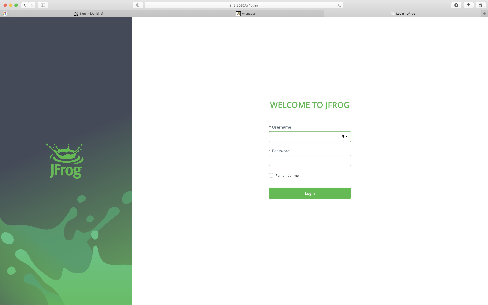

# Prerequirment for Terraform Console 서버
* 실습 진행전 필요한 환경은 아래와 갈습니다.
  - Ubuntu 18.04 +
  - Terraform
  - aws cli
  - python 3.6 +


# Jenkins install with Terraform
* Terraform을 통해 Jenkins 서버, vm01(Tomcat)서버, vm02(Artifactory)서버등을 프로비저닝하고 설치합니다.
* Script
```
cd
git clone https://github.com/Finfra/jenkins_quickstart
cd jenkins_quickstart/terraform/
ssh-keygen -f ~/.ssh/id_rsa -N ''

terraform init
terraform plan
terraform apply -auto-approve
```

* Terraform이 Apply한 결과를 통해 각 서버의 IP를 알아 냅니다.
```
Outputs:
Jenkins-ip = 15.165.74.195
jm1-ip = 3.35.135.184
jm2-ip = 3.35.139.231
```

* 브라우저를 사용할 수 있는 Windows PC에 Host Setting을 하면 편리합니다. Host Setting을 할 수 없는 상황이면 IP 주소를 사용합니다.
```
  - c:\Windows\System32\drivers\etc\hosts
```

* Host File Setting Example for client : 서버의 IP를 아래 코드 IP부분에 적은 후 복사 붙여넣기를 통해 실행합니다.
```
echo "
15.165.74.195  jenkins
3.35.135.184  jm1
3.35.139.231  jm2
">> /etc/hosts

curl jenkins:8080|head -n 100
curl jm1:8080|head -n 100
curl jm2:8082|head -n 100
```

# Jenkins 설치 확인 및 첫 셋팅
* 설치 후 비번 등의 기본적인 셋팅을 진행합니다.
## Jenkins1 : Jenkins Server
* password 얻기(셋팅시 비번 필요)
```
ssh jenkins "sudo cat /var/lib/jenkins/secrets/initialAdminPassword"
```
* PC에서 http://jenkins:8080으로 접속하고 위에서 얻은 비번을 입력하니다.


* 셋팅이 끝나면 URL을 입력합니다. (ip방식으로 접속하시는 분은 IP주소 입력)


* Restart버튼을 클릭해서 jenkins를 재부팅 합니다.


* 재부팅이 끝나면 로그인 합니다.


* 로그인 완료후.


## jm1      : Tomcat Server
* PC에서 http://jm1:8080 으로 접속합니다.
* id/pw : admin/password


* "Manage App"버튼을 클릭해서 로그인을 시도 합니다.


## jm2      : Artifactory Server
* PC에서 http://jm2:8082 으로 접속합니다.
* id/pw : admin/password



* 로그인 성공시


* admin 추가 정보를 입력합니다. [필수 아님]


### OS를 재부팅했다면?
* Artifactory reboot.
```
ssh jm2 "sudo /usr/local/sbin/artifactoryReset.sh"
```

### If you wnat to connect Artifactory OS (jm2)
```
ssh jm2
sudo docker exec -it --user root artifactory bash
```

# Jenkins Stop/Start/status
* Jenkins서버를 종료하고 시작하는 방법입니다.
* 활용 사례 : 플러그인들 중에 설치시 재부팅을 해야 적용되는 것이 있는데 그러한 플러그인 설치시 재부팅하다 걸리면 아래의 스크립트로 재부팅해줍니다.
## jenkins os에 접속합니다.
```
ssh jenkins
```
## Jenkins Stop
* 아래 명령 실행 후 웹페이지에 접속해 봅니다.
```
sudo systemctl stop jenkins
sudo systemctl status jenkins
```
## jenkins Start
* 아래 명령 실행 후 웹페이지에 접속해 봅니다.
```
sudo systemctl start jenkins
sudo systemctl status jenkins
````


* cf) 이미 되어 있어서 진행할 필요는 없지만 jenkins를 서버스로 등록하는 방법입니다. :  systemctl enable jenkins
