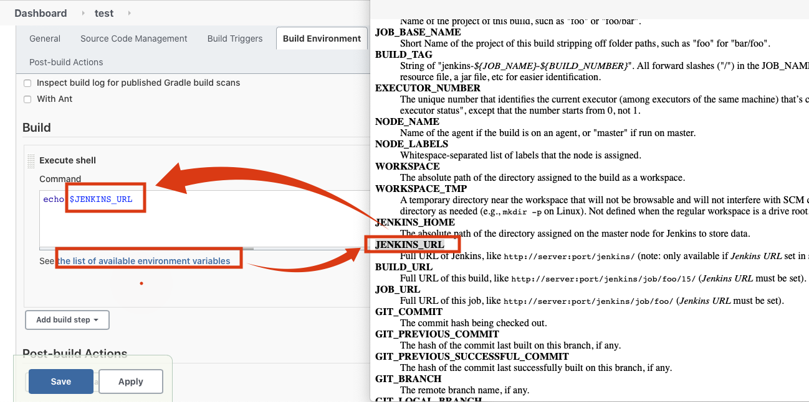

# Jenkins Job 설정 및 대시보드 사용법
## Jenkins Job 설정 연습
1. 첫 접속시 Job 설정 (Main Menu에서 Job생성 가능)

2. "test"라는 Job생성

3. 특정 Shell을 실행도록 셋팅

4. 실행 Shell 입력 [아래 "the list of available environment variables" 링크 참고]

5. Save Click

6. "Build Now" 메뉴 클릭

7. Jenkins Home으로 이동

