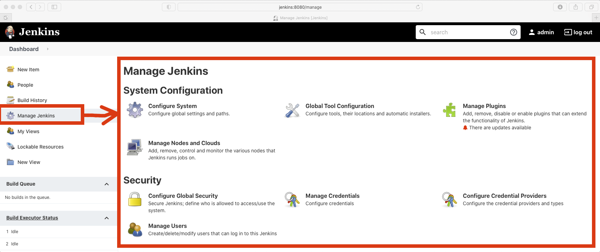
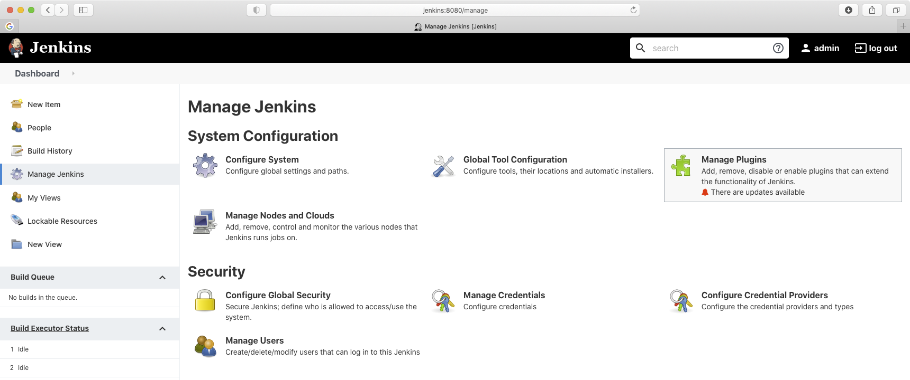
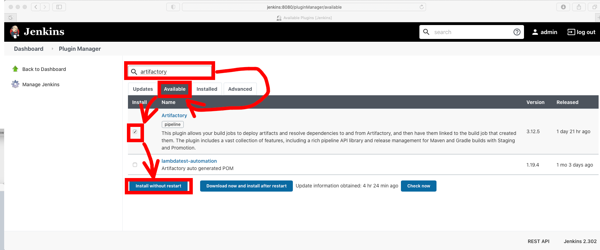
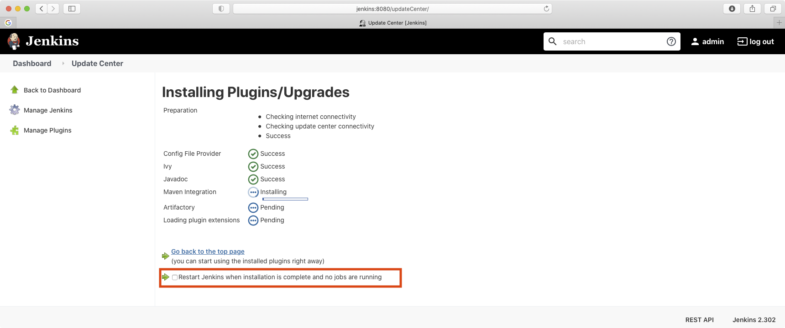
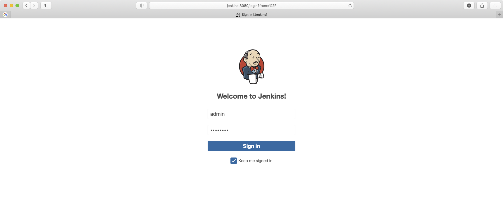
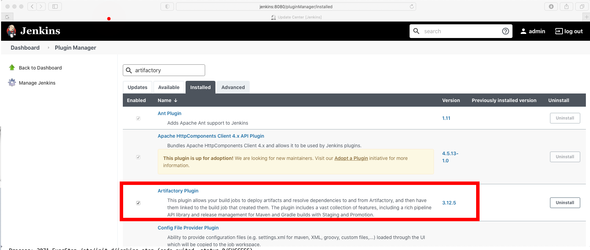

# Jenkins 관리 및 구성 방법
## Plugin install
* jenkins Home에서 "Manage Jenkins"

* "Manage Jenkins"에서 "Manage Plugins" 클릭

* "Artifactory" 플러그인을 아래 그림과 같이 설치합니다.

* 설치가 끝나면 재부팅 옵션을 클릭해 줍니다.

* 다시 로그인 합니다.

* "Manage Jenkins"에서 "Manage Plugins" 클릭후 "Installed" 탭에서 arifactory로 검색하여 설치된 플러그인을 확인 합니다.

