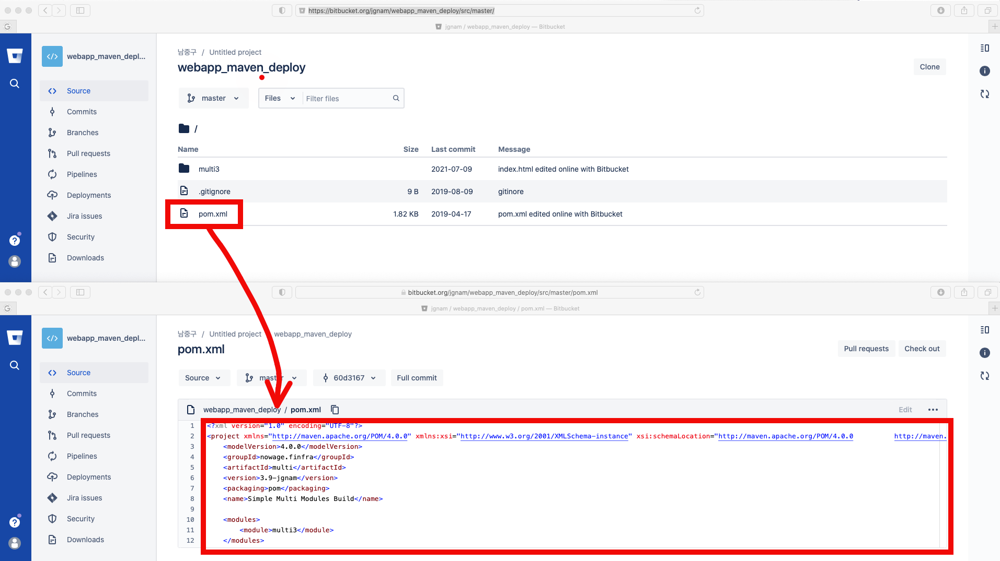

# Maven이란?
## 개발자 입장
* 메이븐을 소스 코드로부터 배포 가능한 산출물 (artifact)을 빌드(build)하는 '빌드 툴(build tool)'
## 프로젝트관리자 /빌드엔지니어 입장
* 프로젝트 관리 툴
## Maven이 하는 일
* 빌드툴 + 빌드에 관한 기능들과 보고서 작성, 웹사이트 생성, 작업팀의 구성원간 소통 기능을 제공


## Maven 용어 정리
* Project – 메이븐이 작업을 수행하는 대상
* Pom – 메이븐이 프로젝트를 처리하는 필요한 정보를 제공하는 파일.
* Artifact – 프로젝트에 필요한 jar, war, pom 혹은 다른 것들.
* Dependency – 프로젝트에 필요한 다른 프로젝트에 존재하는 파일들
* Coordinates – 아티팩트(artifact)를 식별하는데 필요한 속성들의 조합.
* Repository – 아티팩트 (artifact) 들이 위치하는(저장된) 장소.
* Lifecycle – 아티펙트(artifact)를 생성하는 절차들의 집합.
* Phase – 라이프사이클을 구성하는 하나 이상의 절차
* Plugin (Mojo) – 확장(추가) 가능한 기능
* Install – 아티펙트를 로컬 디렉토리에 저장하는 행위 ~/.m2/repository
* Deploy – 아티펙트를 로컬 저장소에 저장하는 행위
* Reactor – 의존성을 분석하고, 해결한 후 빌드를 수행하는 프로세스.

## Maven 실습용 소스 코드 확인
* https://bitbucket.org/jgnam/webapp_maven_deploy.git 에 접속합니다.
### Pom파일을 확인합니다.

