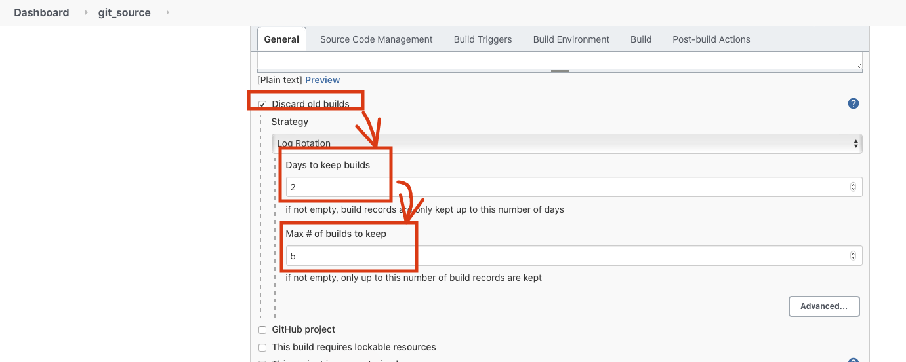

# Maven Jobs 및 Build Modules
* Maven으로 모듈을 빌드합니다.

## 1. 플러그인 설치
* 1. jenkins Menu → Manage Jenkins → Manage Plugins → Available Tab → Build Pipeline 검색
* 2. 체크 → Download now and install after restart

# Item 생성
* 1. New Item → Enter an item name에 git_source입력 → Freestyle Project 선택 → OK 클릭

* 2. Discard old Builds 체크 → Days to Keep builds에 2 입력 → Max # of builds to keep에 5입력

* 3. Source Code Managemen에 git 체 하고 Ripository URL에 https://bitbucket.org/jgnam/webapp_maven_deploy.git 입력

* 4. Build Environment의 Delete workspace before build starts에 체크 하고 Save버튼 클릭

* 5. Jenkins Home에서 "git_source"라는 Item이 생성 되었는지 확인

