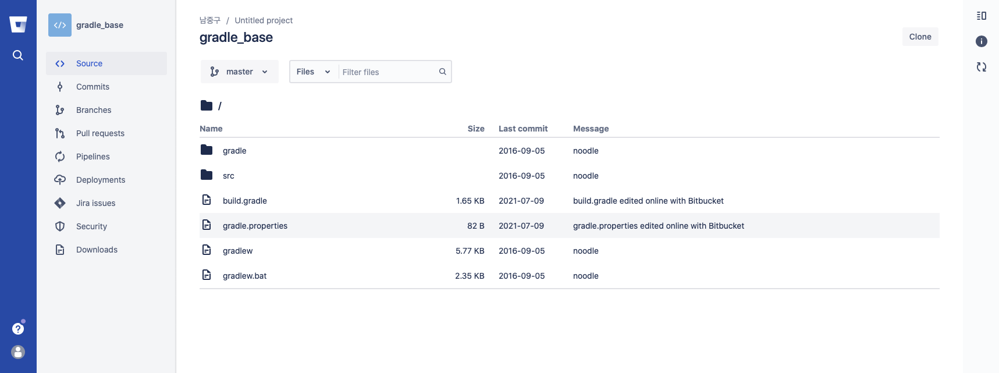
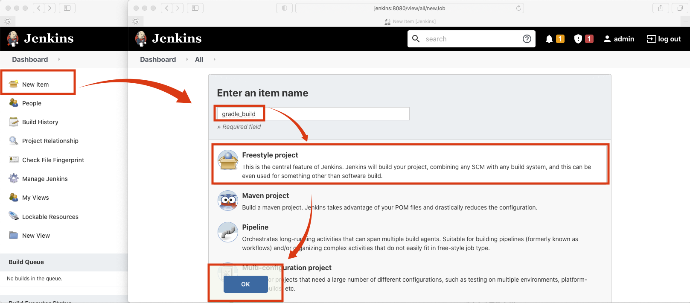
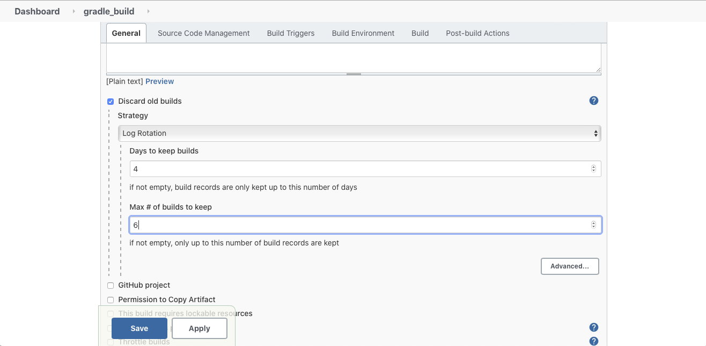
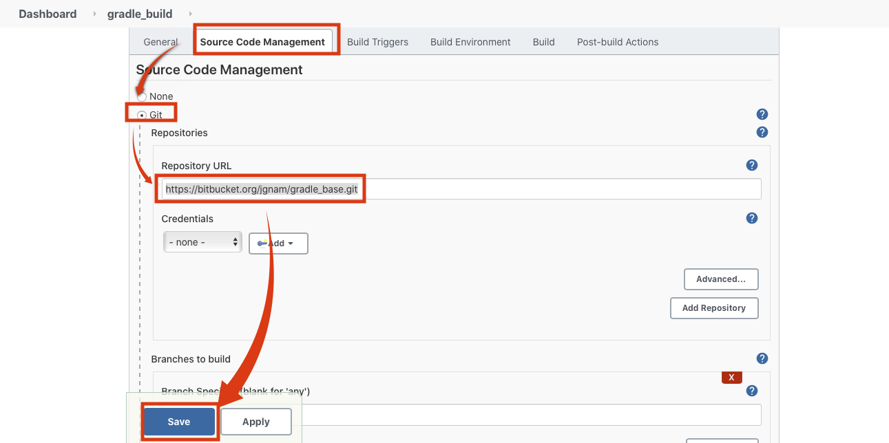
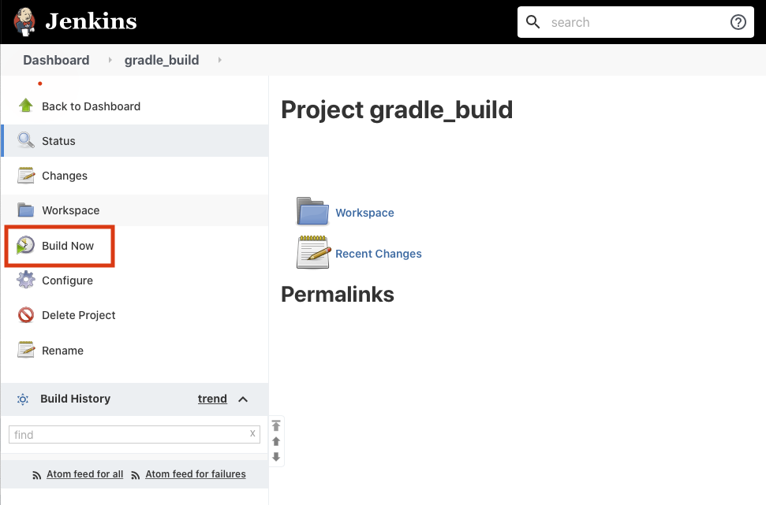
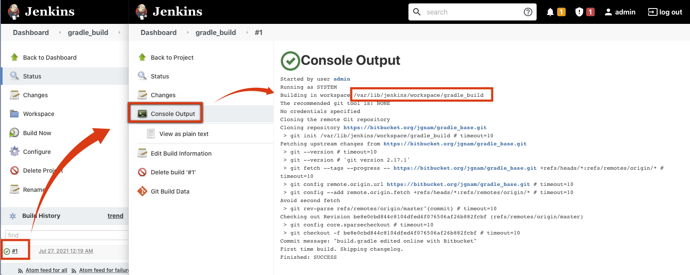
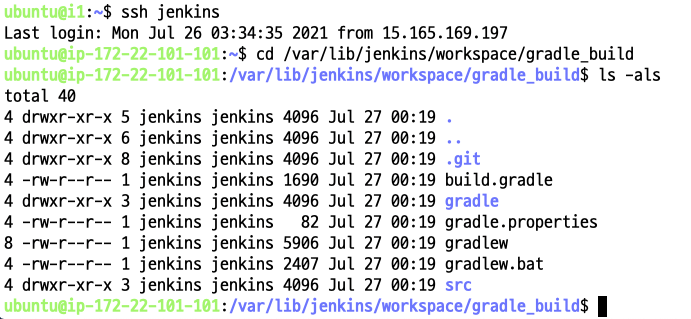

# Gradle Build
* Gradle로 Java Source를 Build하는 예제입니다. 

## Gradle Build Process

1. 아래 git Repository에 접속하여 소스코드를 확인합니다.
  - https://bitbucket.org/jgnam/gradle_base


2. Jenkins Home의 메뉴에서 New Item 클릭 후 Enter an item name에 "gradle_build"라고 입력 후 Freestyle project선택 후 OK

3. Discard old builds에 체크 Days to keep builds에 4입력 Max # of builds to keep에 6 입력

4. Source Code Management의 git선택 후 Repository URL에 https://bitbucket.org/jgnam/gradle_base.git 입력(주의: 끌에 .git 붙일 것) 후 Save 클릭

5. 좌측 메뉴에서 Build Now 클릭

6. 좌측 메뉴 밑에 Build 번후 클릭 후 Console Ouput 클릭 후 Building in workspace Path  복사

7. jenkins서버에 접속 해서 위에서 복사한 Path로 이동 후 생성된 파일 확인

