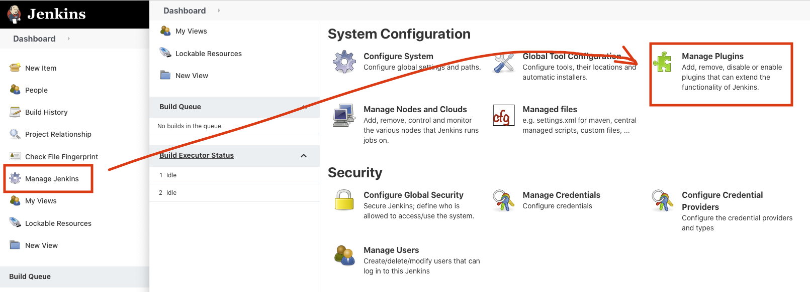
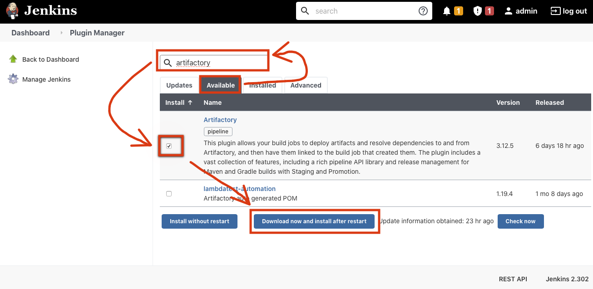
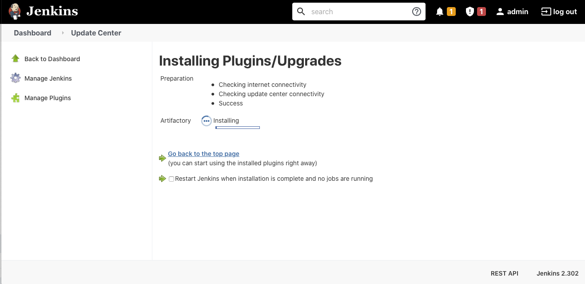
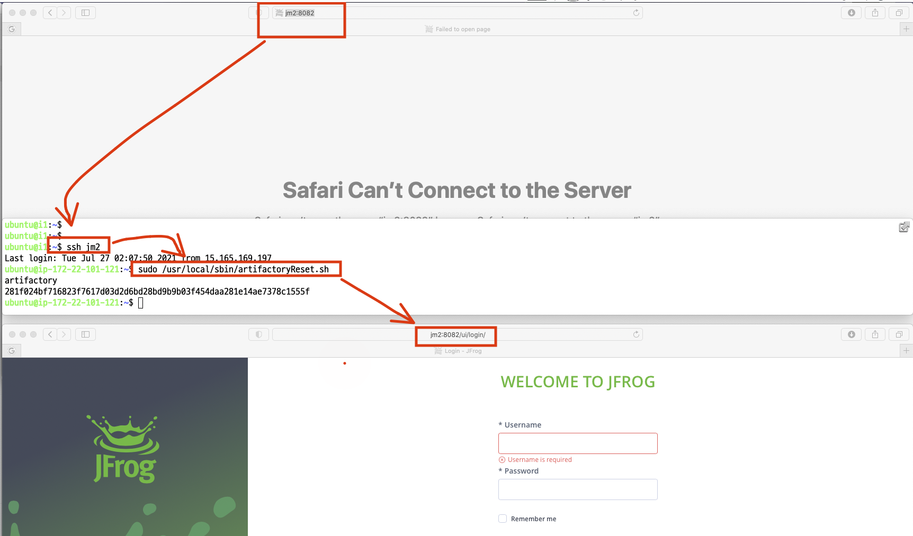
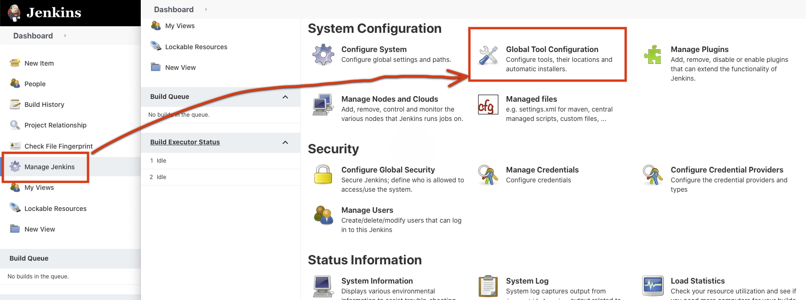
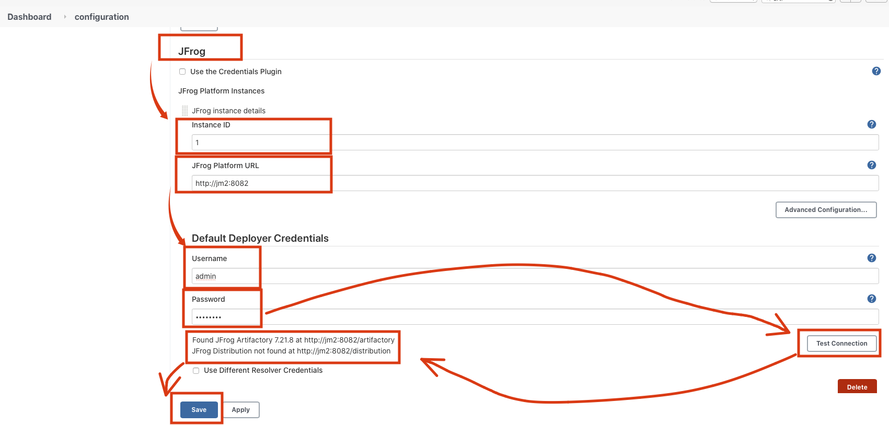

# Artifactory Setting
## Artifactory Plugin 설치
1. Jenkins Home의 메뉴의 Manage Jenkins클릭 후 Manage Plugins를 클릭

2. (Lab1에서 설치 했다면 생략 가능) Available 클릭 → 검색창에 Artifactory 입력 → Artifactory 체크 → Download now and install after restart 버튼 클릭

3. 설치 및 Jenkins Restart 확인

4. Artifactory 서버 작동 여부 확인합니다.
   - http://jm2:8082 접속
   - 접속 실패시 아래 그림과 같이 jm2서버에 접속해서 "sudo /usr/local/sbin/artifactoryReset.sh"입력하고 다시 접속(Artifactory 다시 시작까지 2분정도 소요)
   - Artifactory 로그인하려면 admin/password 사용

5. Jenkins Home에서 Manage Jenkins 메뉴를 클릭하고 System Configuration을 클릭해서 Artifactory 설정할 수 있는 화면으로 들어갑니다.

6. JFrog에서 Instance ID에 1입력, JFrog Platform URL에 http://jm2:8082 입력, Username에 admin 입력, Password에 "password" 입력 후 "Test Connection"클릭하여 작동여부 확인 후 Save 버튼 클릭

