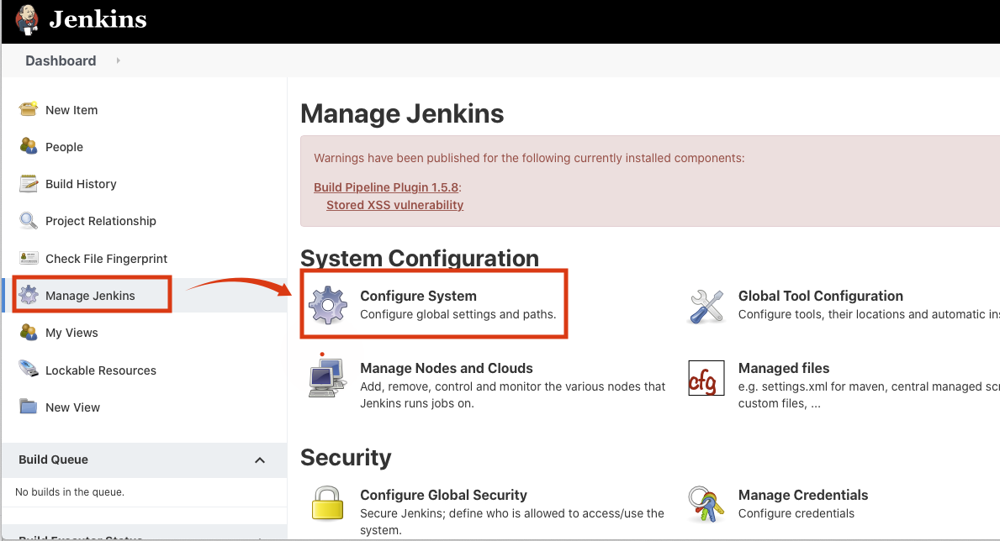

# Artifactory Setting
## Artifactory Plugin 설치
1. Jenkins Home의 메뉴의 Manage Jenkins클릭 후 Manage Plugins를 클릭

2. Available 클릭 → 검색창에 Artifactory 입력 → Artifactory 체크 → Download now and install after restart 버튼 클릭

3. 설치 및 Jenkins Restart 확인

4. Artifactory 서버 작동 여부 확인합니다.
   - http://jm2:8082 접속
   - 접속안되면 아래와 그림과 같이 jm2서버에 접속해서 "sudo /usr/local/sbin/artifactoryReset.sh"입력하고 다시 접속

5. Jenkins Home에서 Manage Jenkins 메뉴를 클릭하고 Global Tool Configuration을 클릭해서 Artifactory 설정할 수 있는 화면으로 들어갑니다. 

6.

7.

8.

9.

10.

11.

12.

