# Gradle과 Artifactory 작업
## Gradle build Item에 Artifactory 셋팅
1. Jenkins Home에서 gradle_build item클릭
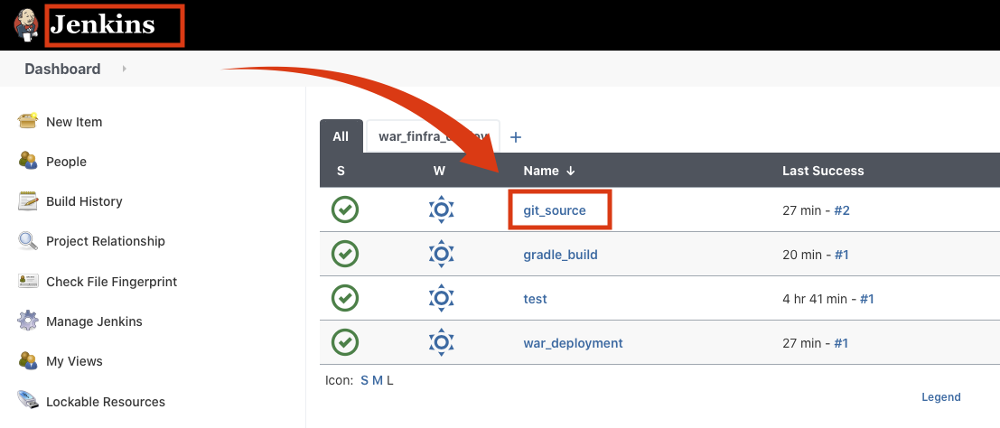

2. 좌측 메뉴에서 Configure 클릭
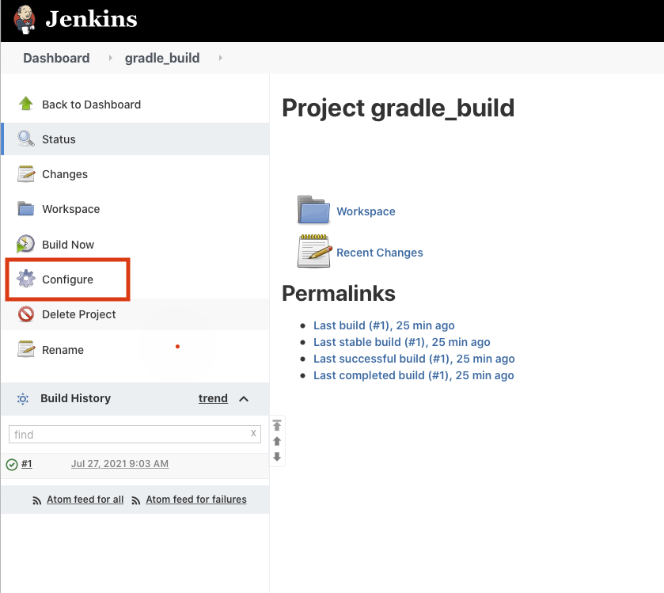

3. Build Environment에서 Gradle-artifactory Integration 클릭
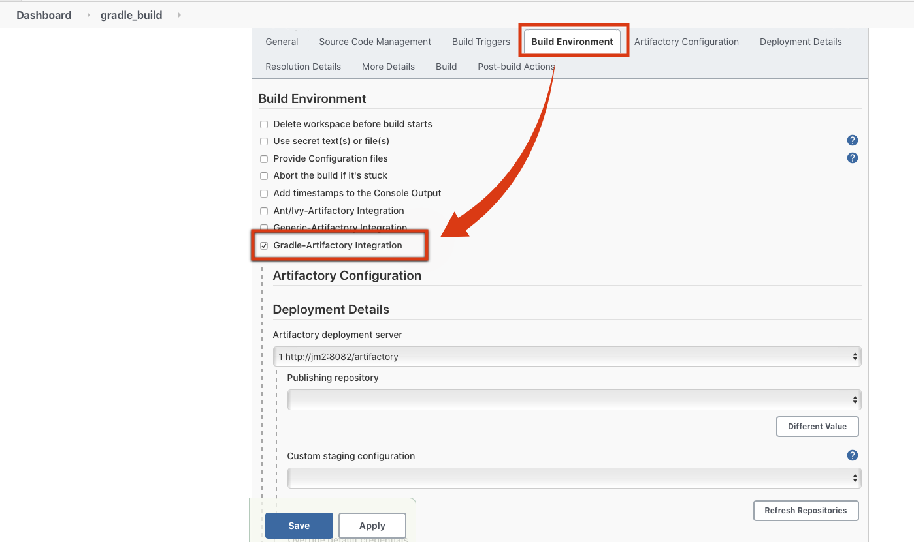

4. More Details에서 Project uses the Artifactory Gradle Plugin에 체크
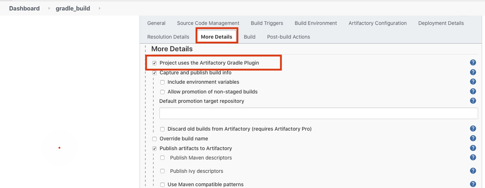

5. Artifactory Configuration에서 Aritifactory deployment server 확인 후 Refresh Repositories 버튼 클릭 후 Publishing repository와 Custom staging Configuration이 Default로 비어 있는 것 확인
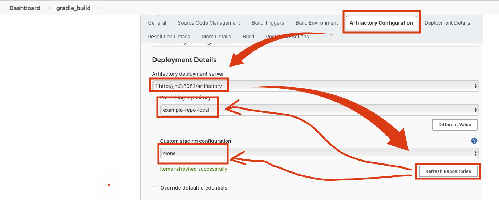

6. build에서 Add build step 클릭 후 Invoke Gradle script 선택
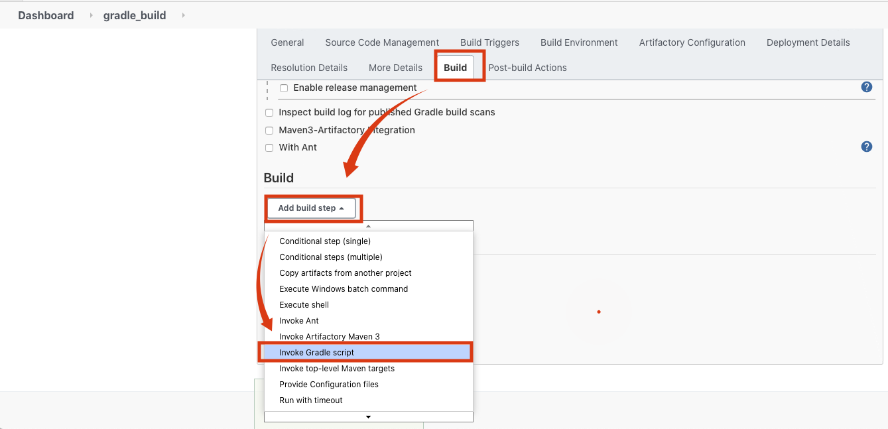

7. Gradle 설정이 잘 되어 있는지 확인 후 Save 버튼 클릭
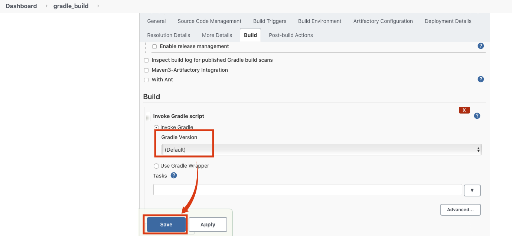

## Jenkins에 Gradle Setting
1. Jenkins Home에서 Manage Jenkins메뉴에서 Global Tool Configuration클릭

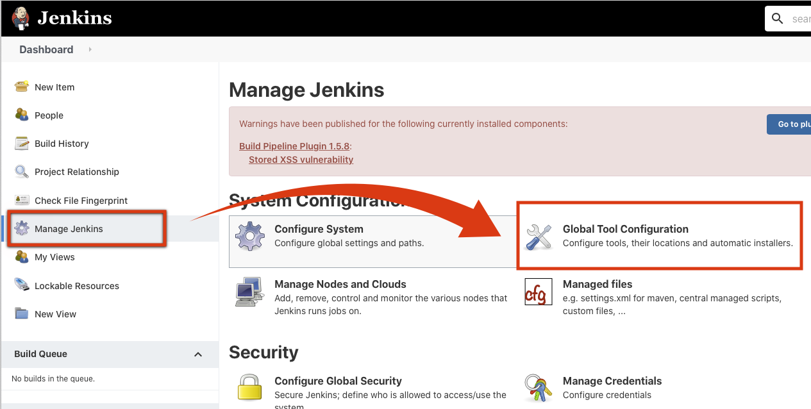

2. Jenkins 서버에 접속해서 gradle 버전 확인

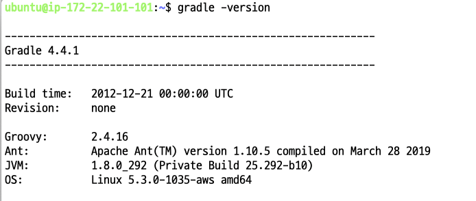

3. Add Gradle 버튼 클릭 후 name에 gradle라고 입력 후 위에서 확인한 Gradle version선택 후 Save버튼 클릭

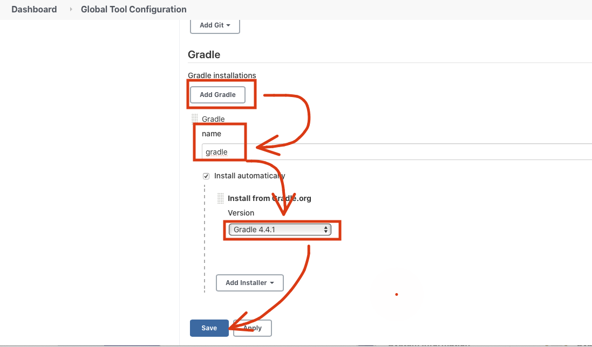

## Gradle build Item에 Gradle 빌드 셋팅 추가
1.

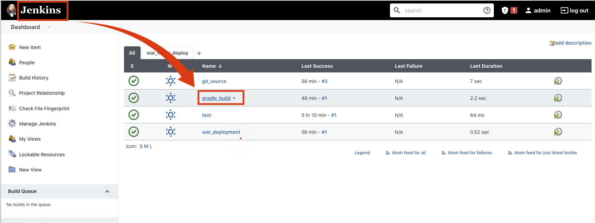

2.

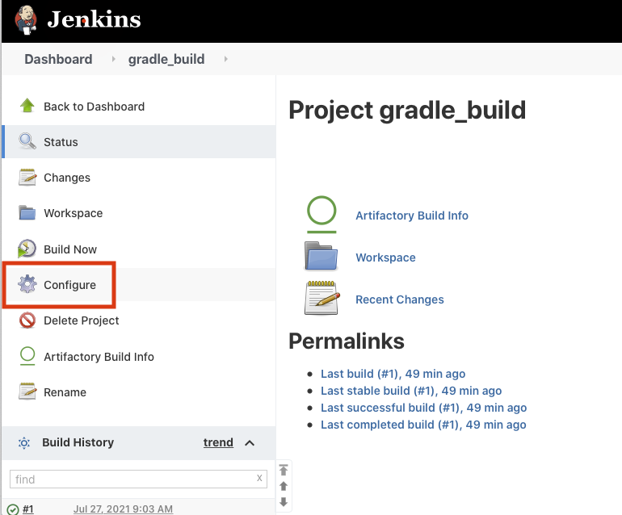

3.

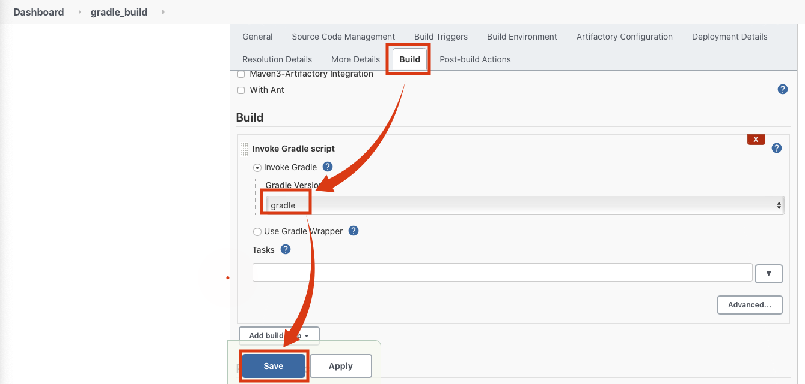

4.

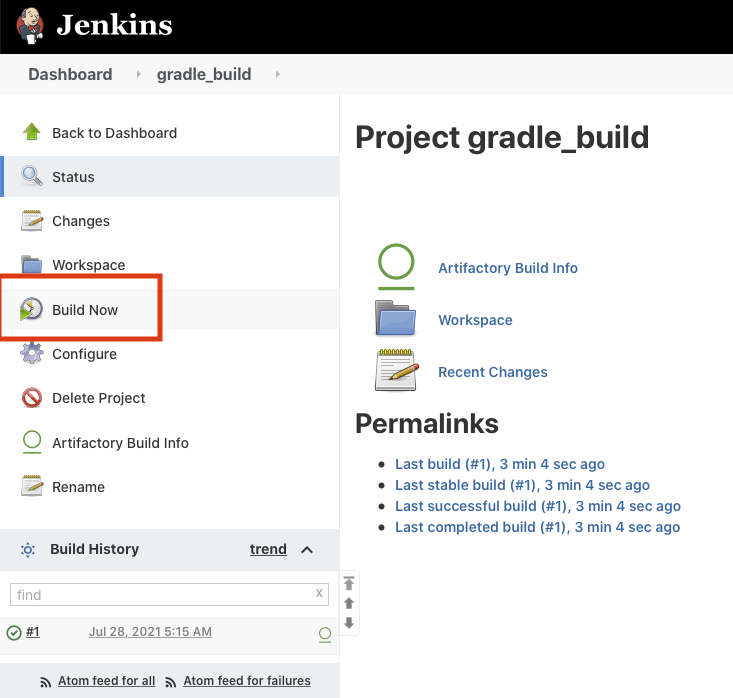

5.

6.

7.

8.

9.

10.

11.

12.

