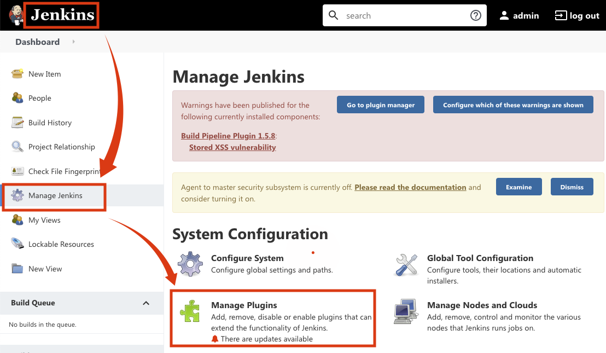
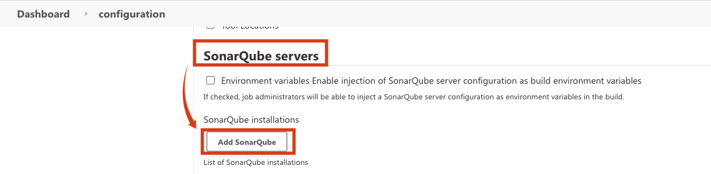

# Java Coding Quality Analysis Plugins and Configuration
* 이번 예제는 Jenkins에서 빌드되는 코드의 Quality를 체크할 수 있는 SonarQube라는 App을 Docker를 통해 Provision하고 셋팅하고 Jenkins와 연동하는 셋팅을 실습하는 예제입니다.

* https://www.sonarqube.org
* https://tomgregory.com/sonarqube-quality-gates-in-jenkins-build-pipeline/

## SonarQube Server Setting
1. SonarQube가 작동할 Docker가 설치되어 있는 서버에 접속
```
ssh ubuntu@jm2
sudo -i
```

2. 아래 Docker 명령 실행
```
docker run -d --rm --name sonarqube -p 9000:9000 sonarqube:lts
```


3. SonarQube서버에 접속
- 주의: 접속 안되면 jm2의 Security Group의 9000포트 열려있는지 확인


4. SonarQube 서버에 접속
  - 초기 비번 admin/admin


5. 비번 셋팅


6. 로그인 성공 화인


7. Admininstration → Security → users → Admininstrator admin의 Token 클릭


8. Generate Tokens의  이름을 입력하고 Generate버튼 클릭해서 토큰을 생성한 뒤 Copy버튼을 클릭해서 토큰 정보를 얻음. Done버튼 클릭)


9. Administration → Configuration → Webhooks


10. Create 버튼 클릭


11. Name에 Jenkins → URL에 http://172.22.101.101:8080/sonarqube-webhook/ 입력 후 Create 버튼 클릭 (SonarQube가 설치된 Docker Container에 hosts파일 셋팅이 되어 있지 않으므로 jenkins의 IP를 입력하세요.)


## Quality Gate 추가
* 기존에 설정되어 있는 옵션도 있지만, 추가로 간단한 Quality 기준을 설정합니다.

1. SonarQube 홈에서 Quality Gate 메뉴를 클릭합니다.
   - Default Built-in Quality Gates를 확인합니다.


2. Create 버튼을 클릭합니다.


3. Name에 finfraQG라고 입력하고 Save버튼을 클릭합니다.


4. Add Condition버튼을 클릭합니다.


5. On Overall Code선택하고 Maintainability Rating에서 Value에 A를 선택하고 Add Condition버튼을 클릭합니다.


6. Set As Default 버튼을 클릭합니다.


## Jenkins에 SonarQube Plugin 설치 및 셋팅
1. Jenkins Home에서 Manage Jenkins에서 Manage Plugins 클릭



2. Available → SonarQube scanner로 검색후 → SonarQube scanner에 Check → Install without restart 버튼 클릭


3. Jenkins Home → Jenkins Home → Configuration System


4. SonarQube servers → Add SonarQube 클릭



5. Name에 SonarQube입력 → ServerURL에 http://jm2:9000 입력 → add 버튼 클릭 안됨을 확인(저장 후 다시 들오오면 클릭 됨) → Save 버튼 클릭


6. 위 3번 절차 다시 실행해서 Configuration System으로 들어옴.

7. SonarQube servers에서 Add버튼 클릭 후 jenkins선택


8. Kind를 Secret text를 선택 후 Secret에 SonarQube Server Setting의 마지막 절차에서 얻은 키를 붙여넣음.


9. ID에 SonarQubeToken이라고 쓰고 Add버튼 클릭


10. Server authentication token에서 SonarQubeToken을 선택 후 Save 버튼 클릭


