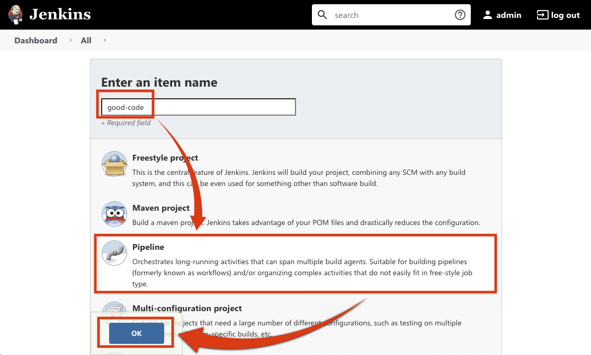

# Unit Testing in Jenkins
* 이번 예제는 정상적인 코드를 Build하면서 SonarQube가 잘 작동하는지 확인하고 비정상적인 코드도 Build하면서 Coding Quality를 체크하고 잘못 된 코드 원문까지 찾아보는 예제입니다.

## 정상적인 코드에 대한 Coding Quality 체크를 위한 Pipline 생성 및 확인
* 정상적인 코드를 build해서 결과를 확인하면서 SonarQube관련 셋팅이 맞는지 검증합니다.

1. Jenkins Home에서 New Item 클릭


2. item name에 good-code라고 입력 → Pipeline선택 → OK 클릭



3.  Pipeline Script에 아래와 같은 코드 입력 후 Save 버튼 클릭
```
pipeline {
    agent any
    stages {
        stage('Clone sources') {
            steps {
                git url: 'https://github.com/finfra/sonarqube-jacoco-code-coverage.git'
            }
        }
        stage('SonarQube analysis') {
            steps {
                withSonarQubeEnv('SonarQube') {
                    sh "./gradlew sonarqube"
                }
            }
        }
        stage("Quality gate") {
            steps {
                waitForQualityGate abortPipeline: true
            }
        }
    }
}
```


4. Build Now 버튼 클릭 후 정상 작동여부 확인


5. SonarQube Home에서 정상 코딩 Quality확인


## 비정상적인 코드에 대한 Coding Quality 체크를 위한 Pipline 생성 및 확인
* 비정상적인 코드들은 build함으로써 해당 파이프가 failed남을 확인해서 SonarQube의 Quality Gate 가 정상적으로 작동하는지 확인하고 해당 소스와 원인을 확인합니다.

1. Jenkins Home에서 New Item 클릭


2. item name에 bad-code라고 입력 → Pipeline선택 → OK 클릭


3.  Pipeline Script에 아래와 같은 코드 입력 후 Save 버튼 클릭
```
pipeline {
    agent any
    stages {
        stage('Clone sources') {
            steps {
                git branch: 'bad-code', url: 'https://github.com/finfra/sonarqube-jacoco-code-coverage.git'
            }
        }
        stage('SonarQube analysis') {
            steps {
                withSonarQubeEnv('SonarQube') {
                    sh "./gradlew sonarqube"
                }
            }
        }
        stage("Quality gate") {
            steps {
                waitForQualityGate abortPipeline: true
            }
        }
    }
}
```


4. Build Now 버튼 클릭 후 Quality Gate에 걸리는 것을 확인


5. SonarQube에서 Failed 난 것을 확인 후 sonarqube-jacoco-code-coverage 클릭


6. Maintainability Rating is worse tha A를 클릭


7. Major issue를 확인


8. Major issue의 원인을 파악함.


